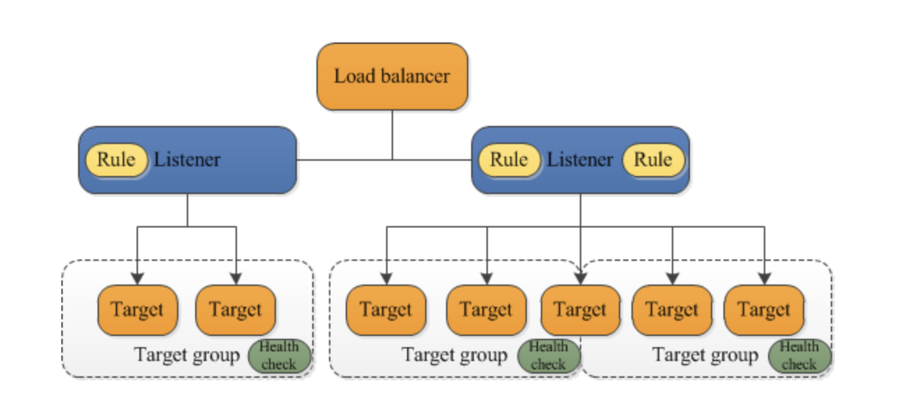

# ALB - Application Load Balancer
Elastic Load Balancing automatically distributes your incoming traffic across multiple targets, such as EC2
instances, containers, and IP addresses, in one or more availability zones. It monitors the health of its 
registered targets, and routes traffic only to the healthy targets. Elastic load balancing scales your load balancer as your 
incoming traffic changes over time. It can automatically scale to the vast majority of workloads.

Elastic load balancing supports the following load balancers: Application Load Balancers, Network Load Balancers, 
Gateway Load Balancers, and Classic Load Balancers.

## Application Load Balancer Components.
A **load balancer** serves as the single point of contact for clients. The load balancer distributes incoming application 
traffic multiple targets, such as EC2 instances, in multiple availability zones. This increase the availability of your application.
You add one or more listeners to our load balancer.

A **listener** checks for connections requests from clients, using the protocol and port that we configure. The rules 
that we define for a listener determine how the load balancer routes requests to its registered targets. Each rule consists of a
priority, and or more actions, and one or more conditions. When the conditions for a rule are met, then its actions are performed.
We must define default rule for each listener, and we can optionally define additional rules.

Each **target group** routes requests to one or more registered targets, such as EC2 instances, using the protocol and port number 
that we specify. We can register a target with multiple target groups. We can configure health checks on a per target group basis.
Health checks are performed on all targets registered to a target group that is specified in a listener rule for our load balancer.

