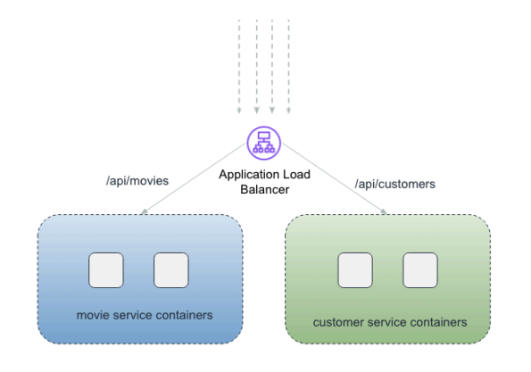

# Netflux

**AWS architecture**:

- VPC + Security Groups
- ALB + Target Groups + Listener Rules
- S3 + CDN
- RDS + Secrets Manager
- ECR
- Finally => Fargate


## Create VPC

To create the VPC, follow the same steps outlined in the [VPC section of this repository](https://github.com/AaronHapy/AWS/tree/main/vpc/create). However, for this setup, we’ll need to create three different security groups.

1. **Application Load Balancer (ALB) Security Group**:  
   - **Name**: `{ourapp}-alb-sg`  
   - **Description**: "Allow external traffic to ALB"  
   - **VPC**: Select the VPC created earlier.  
   - **Inbound Rule**: Allow HTTP traffic from anywhere (`0.0.0.0/0`) on port 80.

2. **Microservices Application Security Group**:  
   - **Name**: `{ourapp}-app-sg`  
   - **Description**: "Allow traffic from ALB to app"  
   - **VPC**: Select the same VPC.  
   - **Inbound Rule**: Allow traffic from the ALB security group on port 8080.

   Remember, microservices (e.g., customer-service and movie-service) need to communicate with each other. While the initial rule allows traffic from the ALB, we need to edit the app security group to add another rule.

    **Microservices Communication Rule**:  
    - Add a new inbound rule:  
        - **Type**: Custom TCP  
        - **Port**: 8080  
        - **Source**: The app security group itself, allowing inter-service communication.

3. **DB Security Group**:  
   - **Name**: `{ourapp}-db-sg`  
   - **Description**: "Allow traffic from backend apps"  
   - **VPC**: Select the VPC created earlier.  
   - **Inbound Rule**: Allow PostgresSQL traffic from the app-sg on port 5432.


## Target Groups

We have 2 backend applications - **customer-service** & **movies-services**. We will receive all the traffic via our application load balancer. Based on the path, we would route the requests to appropitate applications.

- Target Groups
    - movie-service-containers
    - customer-service-containers
- ALB
    - Listener Rules
        - /api/movies* => movie-service-containers
        - /api/customers/* => customer-service-containers



To create target groups, navigate to the **EC2 dashboard**, then search for the **Load Balancing** section. Choose **Target Groups** and click **Create a new target group**. 

1. **Target Type**: Select **IP addresses**.
2. **Listening Port**: Set it to **8080**.
3. **Target Group Name**: Use `movie-service-containers`.
4. **Protocol**: Set to **HTTP**.
5. **VPC**: Select the VPC you created earlier.
6. **Protocol Version**: Choose **HTTP**.

For **Health Checks**:
- **Protocol**: Set to **HTTP**.
- **Path**: Set to `/actuator/health`.
- **Advanced Health Check Settings**:
   - **Healthy Threshold**: 3
   - **Unhealthy Threshold**: 3
   - **Timeout**: 5 seconds
   - **Interval**: 30 seconds
   - **Success Codes**: 200

Click **Next**. Since we don't know the IP addresses, we can leave them blank. When the app starts, it will register itself. Click **Create target group**. Once created, go to the **Attributes** tab and edit the settings. For **Target Deregistration Management**, reduce the timeout to **30 seconds** (as 5 minutes is too long).

Finally, repeat these steps for `customer-service-containers`.

Once the target groups are created, navigate to the **Load Balancer** section and click **Create a new load balancer**.

1. **Name**: Set it to `{ourapp}-alb`.
2. **Scheme**: Select **Internet-facing**.
3. **VPC**: Choose the VPC created earlier.
4. **Mappings**: Select both **Availability Zones** and choose the **public subnets** for each zone (e.g., Public 1 and Public 2).
5. **Security Group**: Attach the security group we created for the ALB.

Our ALB will listen on **port 80**. For the default target group, select `movie-service-containers`. We can update the routing rules later.

In the **Listener and Routing** section:
- **Protocol**: HTTP
- **Port**: 80
- **Default Action**: Use the `movie-service-containers` target group as the default action.

Click **Create Load Balancer** to complete the setup.

Once the ALB is created, go to the **Listeners and Rules** tab. You will see one entry. Click on **1 rule**, then select the default rule and click **Edit**. In the **Default Actions** section, choose **Return fixed response**. Change the response code to **404** and set the response body to whatever you prefer. Click **Save changes**.

Next, add a new rule. You can name it **all movies requests**, then click **Next** and add a new condition. We need **Path-based routing**, so any request to `/api/movies*` should be routed to `movies-service-containers`. 

For the rule condition:
- Select **Path**.
- Set the path to `/api/movies*`.
- Click **Confirm**, then **Next**.

For the target, select **Forward to target groups** as the routing action, and choose `movie-service-containers` as the target group. Set the priority to **500** and click **Create rule**.

Repeat these steps for **customer-service** requests.

## S3 + CloudFront

Let's start by creating an S3 bucket to store static content for the frontend team. 

1. Go to **S3** and create a new bucket.  
2. Choose **General Purpose** as the bucket type.  
3. Name the bucket `{ourapp}-bucket`. 

This bucket will store static files and **should not** contain any sensitive information. You can proceed with all the default settings and click **Create bucket**.

Next, create a dummy `index.html` file and upload it to the newly created bucket. Here's an example:

```html
<html>
    <body>
        <h1>Hello World</h1>
    </body>
</html>
```

Next, go to **CloudFront** and click on **Create a CloudFront distribution**. 

1. For the **Origin Domain**, select the S3 bucket we created earlier.  
2. To avoid providing public access to the bucket directly, use **Origin Access Control (OAC)** to allow CloudFront to access and serve the static files.  
   - In the **Origin Access** settings, choose **Origin access control settings**.
   - Click **Create new OAC** and select **Sign requests (recommended)**, then click **Create**.

For the **Web Application Firewall (WAF)**, select **Do not enable security protections**. Under **Price Class**, choose **Use all edge locations (best performance)**. In the **Default Root Object**, type `index.html`, then click **Create distribution**.

Once CloudFront is created, it will provide a **Policy**. This policy needs to be attached to the S3 bucket.

1. Click **Copy Policy**.  
2. Go to the **S3 bucket** created earlier, select the **Permissions** tab, and edit the **Bucket Policy**.
3. Paste the policy copied from CloudFront and save.

Go back to the CloudFront dashboard and check if the distribution is deployed. Once deployed, it will display the last modified date instead of "deploying." 

Copy the provided **CloudFront domain** and paste it into your browser—you should see "Hello World."

---

### CloudFront Origins & Behaviors:
- **S3** will be the origin for static files.
- **ALB** will be the origin for any API requests.


Create another origin for the ALB:

1. In the **Origin Domain**, choose the application load balancer we created earlier.  
2. Set the **Origin Protocol** to **HTTP**, then create the origin.

Next, go to the **Behaviors** tab and click **Create new behavior**. 

1. In the **Path Pattern** section, enter `/api/*`.  
2. Under **Origin and Origin Groups**, select the application load balancer created earlier.  
3. For the **Viewer Protocol Policy**, choose **HTTPS**.
4. For **Allowed HTTP Methods**, select the option that includes **PATCH** and **DELETE**.
   
Click **Create behavior**.

To test the configuration, copy the CloudFront domain, paste it into your browser, and add `/api/test` to the URL. This should confirm that the request was routed to the ALB, and you should see the default ALB response, which in this case will display a sad face (`:(`) since the "test" path doesn't exist.