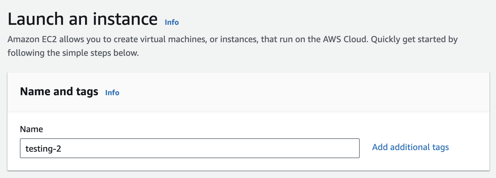
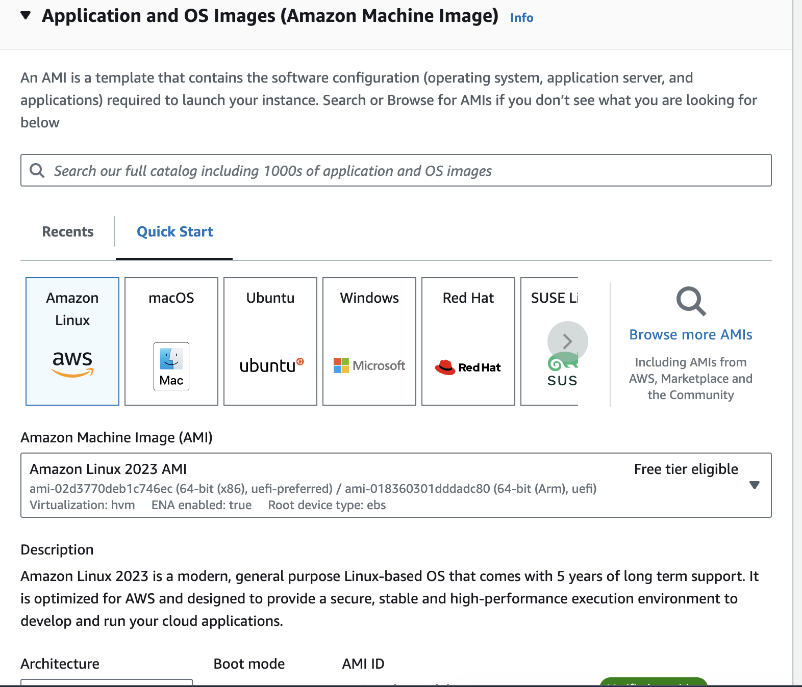
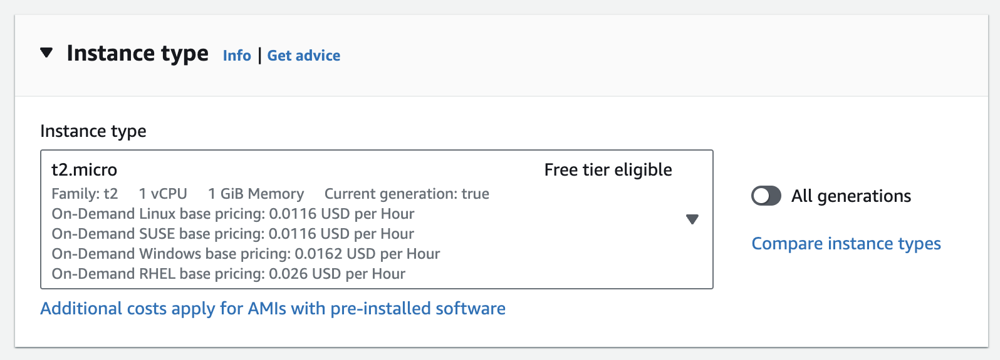
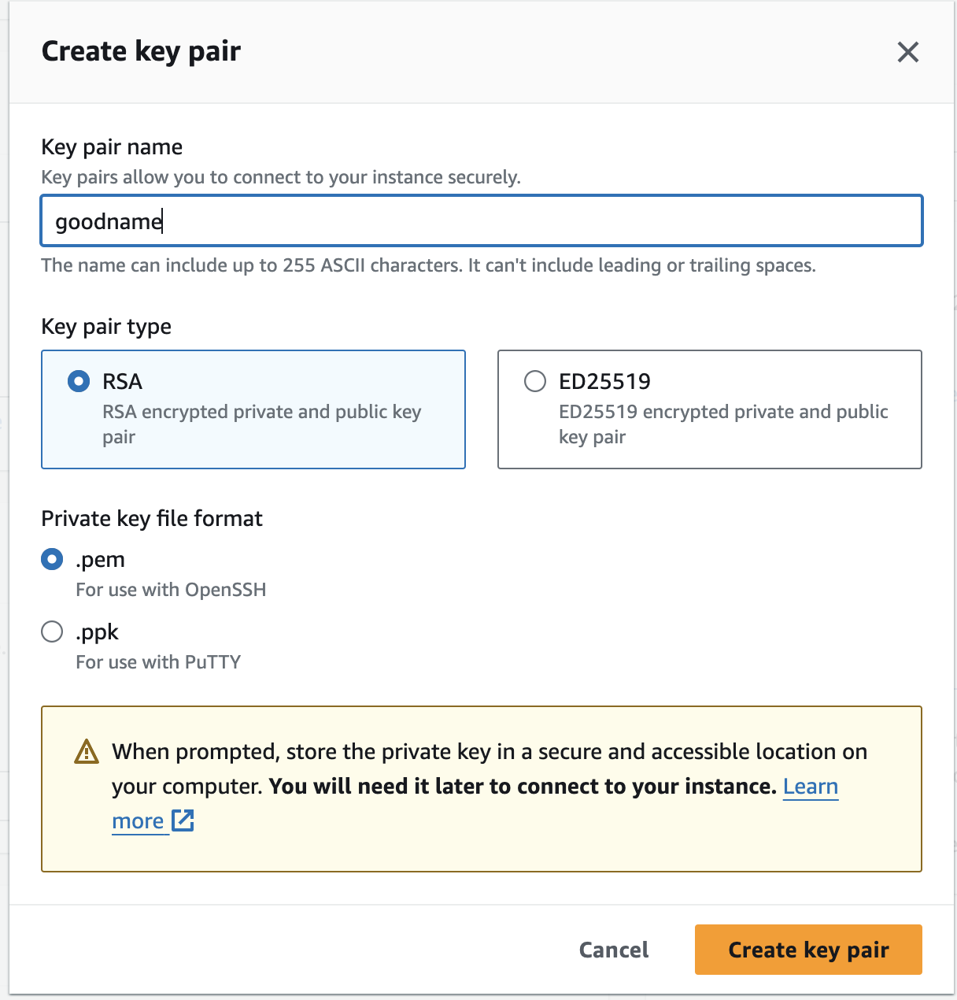
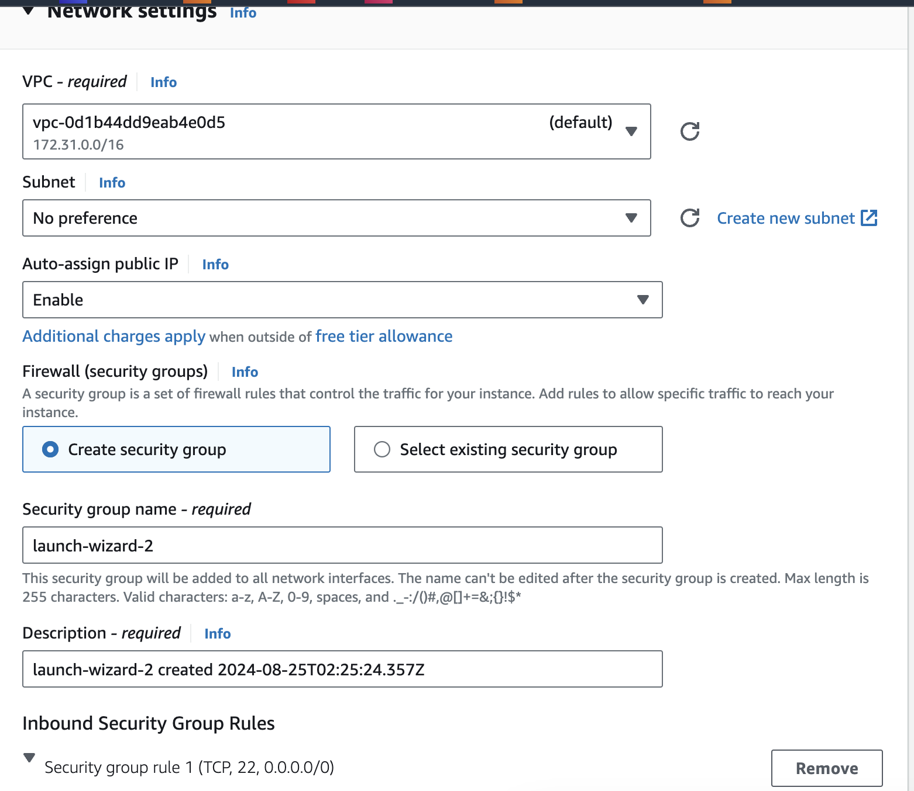

# EC2 / Elastic Computing Cloud

EC2 stands for Amazon Elastic Compute Cloud. It is a web service provided by AWS
that offers resizable compute capacity in the cloud. EC2 allows us to rent virtual servers,
known as instances, to run our applications. With EC2, we can quickly scale our computing
resources up or down based on our needs, paying only for the capacity we use. It provides a flexible and cost-effective solution for hosting applications, running batch jobs, and supporting other computing requirements in the cloud.

**cloud terminologies**
- Region
- Availability Zone (AZ)
- Edge Location / Point of Presence (POP)

**ec2**
- Elastic Computing Cloud
- Service which provides resizable computing capacity in the cloud!
- Launch a VM in a minute!
    - OS / AMI (Amazon Machine Image)
    - CPU / Memory
- Scale up and down depending on the requirements.


## EC2 - Pricing Model

| Model      | Description |
| ----------- | ----------- |
| on-demand      | Launch a VM. Use it as long as you want. Pay / hour basis       |
| reserved   | Reserve a VM for 1 year or 3 years        |
| dedicated   | Fully dedicated physical hardware in the cloud for your use!        |
| spot   | Up to 90% discount (Unused VMs in the Data Center. AWS might reclaim these instances any moment - with a 2 minutes warning)        |

**security group** is a set of firewall rules that control the traffic for our instance. Add rules to allow specific traffic to reach our instance.

**ARN** = Amazon Resource Name

**Monitoring** = CPU / Network packet metrics. Memory is not included by default.

When creating a new instance in EC2, we need to specify the name and tags. The name can be anything we choose. Next, we need to select the operating system (OS) and its version, along with the type of architecture. After that, we choose the instance type, which determines how much CPU and RAM the machine will use. We also need to select a key pair, which is used to connect to the instance. This step is highly recommended, and I would even say it’s required. You can select the 'Create new key pair' option, provide a name for the key, choose the RSA option (which is the type of key), and finally, select the .pem file format for Mac/Linux or .ppk for Windows. Then, create a new security group by giving it a descriptive name. Once all these steps are complete, you can click the 'Launch instance' button to create the new EC2 instance.








Here are a few commands we can use to connect to the EC2 instance from our terminal, install Java or Docker, and do whatever we want with it.

When you want to connect to the EC2 instance from your host, you need to adjust the file permissions of the private SSH key. Otherwise, when you try to connect, you might receive an error message from AWS, such as: 'WARNING: UNPROTECTED PRIVATE KEY FILE! It is required that your private key files are NOT accessible by others.' This happens because SSH requires that your private key file be readable only by the owner for security reasons.

```
chmod 400 {private key}
ssh -i {key.prem} ec2-user@{ipaddress}
sudo yum install docker -y
sudo systemctl start.service

sudo yum install java docker postgresql15 -y
sudo systemctl start docker.service
sudo systemctl enable docker
sudo usermod -aG docker $USER

docker run -p 5432:5432 -e POSTGRES_PASSWORD=password postgres

psql -h {privateIP} -U postgres
```

## Amazon Machine Image (AMI)

We can also use Amazon Machine Image (AMI), this ons is a template that contains a software configuration (operating system, application server, and applications) necessary to launch an EC2 instance. we can create our own AMI or use pre-built one provided by AWS or AWS Marketplace vendors.

To create an AMI, first, launch an EC2 instance and configure it with the desired software and settings. Then, go to the EC2 Instances dashboard, select the instance you configured, click on Actions → Image and templates → Create image. Finally, when launching a new instance, instead of choosing a base OS like Amazon Linux, Windows, or macOS, select the AMI tab and choose the AMI you created.

## Security Groups

Think of Securoty Groups as virtual firewalls that control the traffic to and from our AWS resources. Like a bouncer at a club, they decide which network traffic is allowed or blocked based on rules we define. Unlike traditional firewalls that might require complex hardware and maintenance, securoty groups are software-based and easy to manage through the AWS management console.

Each security group contains a set of rules that determine what kind of traffic can enter or exit an AWS resource, such as an EC2 instance (amazon's  virtual servers), an RDS database, or a Lambda function. These rules can specify protocols (like TCP, UDP, or ICMP), port ranges (like 80 for HTTP or 443 for HTTPS), and sources or destinations (such as IP addresses, CIDR blocks, or other security groups)

### How Do Security Groups Work?

Security groups operate at the instance level, meaning each instance can have its own set of security groups. This setup provides flexibility, allowing you to apply different rules to different resouces depending onour needs.

- **Inbound Rules:** Define what kind of incoming traffic is allowed. for example, you might permit HTTP traffic on port 80 from any IP address if you're hosting a public website. Alternatively, you could restrict SSH access on port 22 to a specific IP address to enhance security.
- **Outbound Rules:** Define what kind of outoging traffic is allowed. By default, security groups are permissive for outbound traffic, allowing all outoging connections. This setup is useful because it prevents accidental data leaks while still allowing instances to communicate with each other and external services.