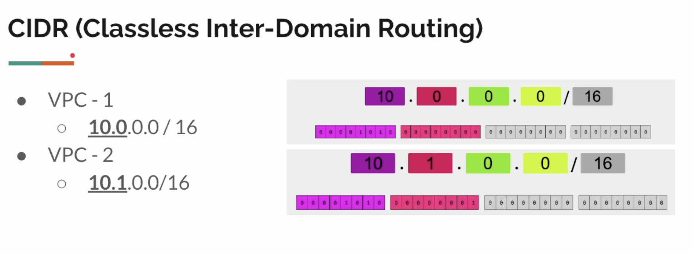
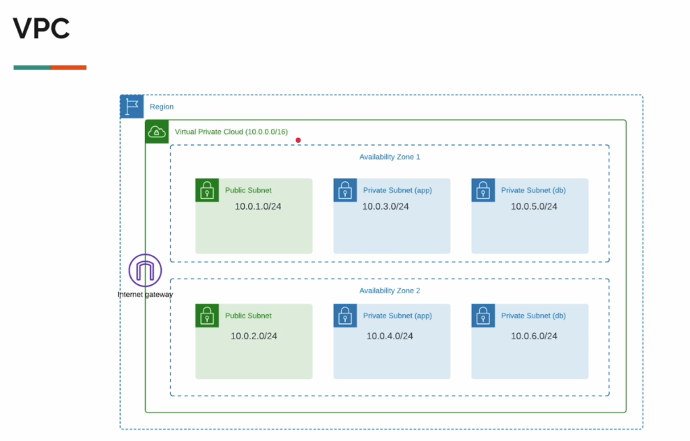
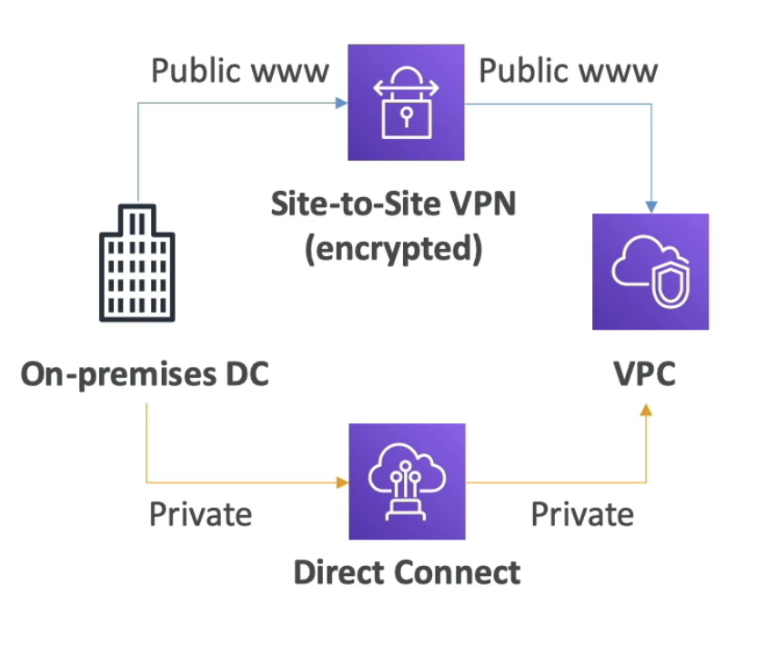
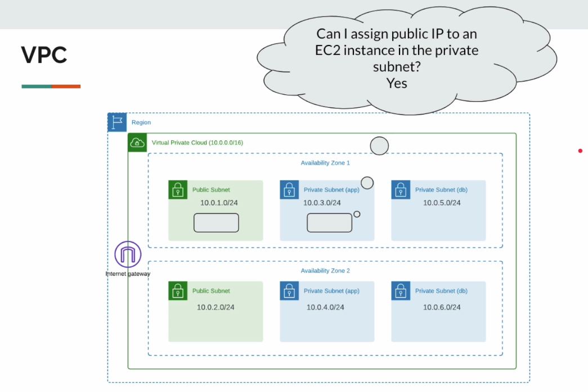
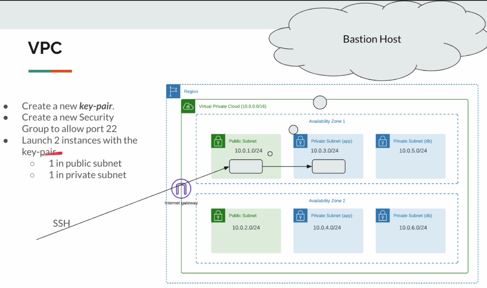
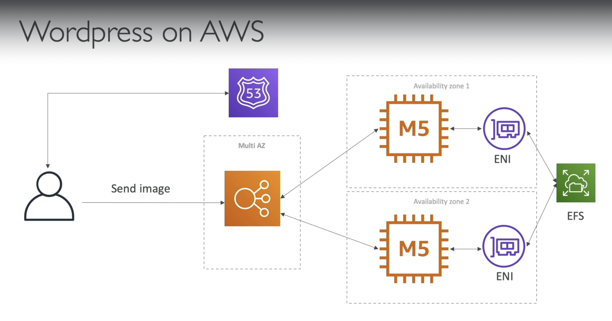

# VPC (Virtual Private Cloud)

- Virtual network dedicated to our AWS account.
- Logically isolated section in the AWS Cloud where we create our resources like EC2, RDS, ALB, etc.
- We have complete control on IP address ranges, subnets creation, route table configuration, etc.

When we create our AWS account, the regions come with a default VPC.

**Goal**

- VPC
- Public/Private subnets
- CIDR
- Internet Gateway
- NAT Gateway
- NACL
- How to architect our network infrastructure for production grade applications.

**Region / AZ**

**VPC**

**Subnet**

- Logical subdivision of IP address range within VPC
    - VPC => House
    - Subnet => Room
- Subnets resides within a single AZ
- We create EC2 instances, Databases, ALBs into specific subnets.
- Benefits
    - Isolating resources within VPC
    - Control inbound and outbound traffic

**Public Subnet**

- Each region comes with a default VPC.
    - Default VPC has 1 subnet per AZ
        - It is a public subnet.
        - A subnet which has direct access to the internet.
- If we need to allow our application to be accessible from the internet, then the application has to be placed inside this public subnet.
    - (Could be a security risk)

- Security Risk
- Security Group is not enough!
    - People make mistakes!
- We have had many data breaches!
    - Not because of AWS
    - Poor understanding of network config / firewall rules etc

**Internet Gateway**

**Private IP**

**Public IP**

**Defense In Depth!**

- Deploying multiple layers of defense mechanism!
- Layered Security.
- Redundancy.
- It's all about infrastructure security & compliance.

**Recommended Approach**

- Create our own VPC for our applications!
    - With multiple subnets across multiple AZs to provide high availability and fault tolerance.
- Customize network settings / IP address ranges
- Deploy our application in private subnets which are NOT directly reachable in the internet.
- Use AWS resources like CloudFront / ALB as front-facing while our application is hidden behind these AWS resources in private subnets.
- Our app can be accessed only via ALB / CloudFront (using security groups / bucket policies)

## CIDR

CIDR (Classless Inter-Domain Routing) is just a part or an extension of an IP. CIDR is nothing but a range of IP addresses a network uses. It is 
also called supernetting. 

The internet protocol (IP) is a set of rules, for addressing packets of data so that they can travel across networks and arrive at the 
correct destination. An IP address is a unique string of characters that identifies each computer using the internet protocol to communicate over a network.

- IPv4: It is the first version of the internet protocol address. In this internet protocol security (IPSec) with respect to network security is optional.

- IPv6: It is the recent version of the internet protocol address. In this internet protocol security (IPSec) with respect to network security is mandatory.

**Classification of IP addresses**:

For technical reasons, the allocation of IP addresses has to follow the topology of the network and not geography or national borders.
Therefore, the addresses are allocated for use in specific networks, as they are required. On the basis of addressing, IP addresses are divided into two classes, they are:

- Classful IP addressing.
- Classless IP addressing (or) CIDR

**Classful Addressing**:

Classful addressing is an IPv4 addressing architecture that divides the 32-bit IP address into five sub-classes, witch each class with a valid range of IP. every IPv4 address can be divided into two parts.

Network ID: Identifies the specific network where the device is located.
Host ID: Identifies a specific device in that network.

Example: 

192.168.32.170, the network id would be: 192.168.32 and the hostId would be: 170

In simple words Host ID is like your door number and network Id is like the rest of your address containing street name, state, country. 

**Classless IP addressing (or) CIDR**
In order to reduce the wastage of IP addresses a new concept of Classless Inter-Domain Routing is introduced. In CIDR the block of IP addresses is assigned dynamically based on specific rules. CIDR is a group of IP addresses that are allocated to the customer when they demand a fixed number of IP addresses.

- VPC - PROD
    - 10.0.0.0 / 16
    - Subnet - 1
        - 10.0.1.0/24
    - Subnet - 2
        - 10.0.2.0/24
            - EC2 - 10.0.2.18
    - Subnet - 3
        - 10.0.3.0/24
    - Subnet - 4
        - 10.0.4.0/24

## Create custom VPC

**Route Table**

A set of rules - called routes - which determine where network traffic from the subnet is directed.

EC2 instance in the private subnet cannot be accessed directly from the internet even if it has public IP, also
EC2 instance in the private subnet cannot access internet directly.

**SSH - Private Instance**
A VPC can be integrated with corporate network using VPN

- Create a new key-pair
- Create a new security group to allow port 22
- Launch 2 instances with the key-pair
    - 1 in public subnet
    - 1 in private subnet

**Private Subnet**

- How can an instance in the private subnet can call services in the internet/outside VPC, if required?
- Note
    - Private subnet instances do not have public IPs
    - We cannot associate internet gateway to private subnets

