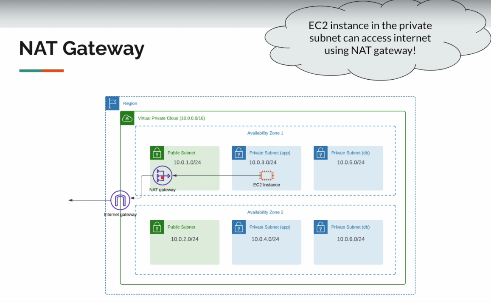

# VPC (Virtual Private Cloud)

- Virtual network dedicated to our AWS account.
- Logically isolated section in the AWS Cloud where we create our resources like EC2, RDS, ALB, etc.
- We have complete control on IP address ranges, subnets creation, route table configuration, etc.

When we create our AWS account, the regions come with a default VPC.

**Goal**

- VPC
- Public/Private subnets
- CIDR
- Internet Gateway
- NAT Gateway
- NACL
- How to architect our network infrastructure for production grade applications.

**Region / AZ**

**VPC**

**Subnet**

- Logical subdivision of IP address range within VPC
    - VPC => House
    - Subnet => Room
- Subnets resides within a single AZ
- We create EC2 instances, Databases, ALBs into specific subnets.
- Benefits
    - Isolating resources within VPC
    - Control inbound and outbound traffic

**Public Subnet**

- Each region comes with a default VPC.
    - Default VPC has 1 subnet per AZ
        - It is a public subnet.
        - A subnet which has direct access to the internet.
- If we need to allow our application to be accessible from the internet, then the application has to be placed inside this public subnet.
    - (Could be a security risk)

- Security Risk
- Security Group is not enough!
    - People make mistakes!
- We have had many data breaches!
    - Not because of AWS
    - Poor understanding of network config / firewall rules etc

**Internet Gateway**

**Private IP**

**Public IP**

**Defense In Depth!**

- Deploying multiple layers of defense mechanism!
- Layered Security.
- Redundancy.
- It's all about infrastructure security & compliance.

**Recommended Approach**

- Create our own VPC for our applications!
    - With multiple subnets across multiple AZs to provide high availability and fault tolerance.
- Customize network settings / IP address ranges
- Deploy our application in private subnets which are NOT directly reachable in the internet.
- Use AWS resources like CloudFront / ALB as front-facing while our application is hidden behind these AWS resources in private subnets.
- Our app can be accessed only via ALB / CloudFront (using security groups / bucket policies)

