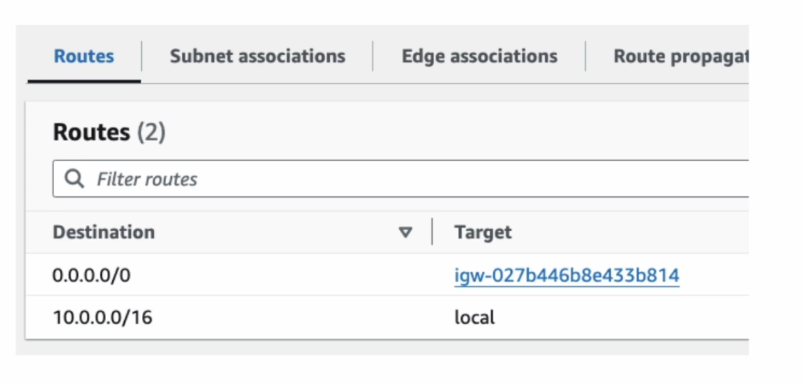

# VPC (Virtual Private Cloud)

VPC is a service that allows you to create a private, isolated network within the AWS cloud. With VPC, you can 
launch resources in a virtual network that you define. VPC provides you with complete control over your virtual networking environment,
including IP addressing, subnets, routing tables, and network gateways.

## Why use AWS VPC?

AWS VPC allows you to create a secure and isolated network for your resources, which provides a high level of security and control.
This means that you can create your own private network, which is not accessible from the internet or other networks. AWS VPC also
enables you to create a VPN connection between your on-premises infrastructure and your AWS VPC. This connection allows you to access
resources in your VPC from your on-premises infrastructure.

When we create our AWS account, the regions come with a default VPC.

## Subnet

A subnet is a range of IP addresses in your VPC. You can launch resources, such as EC2 instances and RDS databases, in a subnet. You can also assign different subnets to different availability zones to achieve high availability and faul tolerance.

- Logical subdivision of IP address range within VPC
    - VPC => House
    - Subnet => Room
- Subnets resides within a single AZ
- We create EC2 instances, Databases, ALBs into specific subnets.
- Benefits
    - Isolating resources within VPC
    - Control inbound and outbound traffic

## Public Subnet

A public subnet is a subnet that is accessible from the internet. so that subnet can access to the world wide web and also can be accessed fron the world wide web.

- Each region comes with a default VPC.
    - Default VPC has 1 subnet per AZ
        - It is a public subnet.
        - A subnet which has direct access to the internet.
- If we need to allow our application to be accessible from the internet, then the application has to be placed inside this public subnet.
    - (Could be a security risk)

- Security Risk
- Security Group is not enough!
    - People make mistakes!
- We have had many data breaches!
    - Not because of AWS
    - Poor understanding of network config / firewall rules etc

## Private Subnet

A private subnet is a subnet that is not accessible from the internet.

- How can an instance in the private subnet can call services in the internet/outside VPC, if required?
- Note
    - Private subnet instances do not have public IPs
    - We cannot associate internet gateway to private subnets

## Internet Gateway

- Internet Gateway helps our VPC instances connect with the internet.
- Public subnets have a route to the internet gateway.

public subnets will have a route to an internet gateway.

An internet gateway is a horizontally scaled, redundant, and highly available VPC component that allows you 
communication between instances in your VPC and the internet.   

## Route Table

To define access to the internet and between subnets, we use Route Tables.

A set of rules - called routes - which determine where network traffic from the subnet is directed.

EC2 instance in the private subnet cannot be accessed directly from the internet even if it has public IP, also
EC2 instance in the private subnet cannot access internet directly.

## NAT Gateway
NAT gateways (AWS-managed) & NAT instances (self-managed) allow your instances in your Private Subnets
to access the internet while remaining private.

A network address translation (NAT) gateway enables instances in a private subnet to connect to the internet or others AWS
services while preventing the internet from initiating connections with the instances.

## Network ACL & Security Groups
NACL (Network ACL)
- A firewall which controls traffic from and to subnet
- Can have ALLOW and DENY rules
- Are attached at the Subnet level
- Rules only include IP addresses.

Security Groups
- A firewall that controls traffic to and from an ENI (elastic network interface) / an EC2 instance.
- Can have only ALLOW rules
- Rules includes IP addresses and other security groups.

## VPC Flow Logs
Capture information about IP traffic going into your interfaces:
- VPC Flow Logs
- Subnet Flow Logs
- Elastic Network Interface Flow Logs

Helps to monitor & troubleshoot connectivity issues. Example:
- Subnets to internet
- Subnets to subnets.
- Internet to subnets.

Captures network information from AWS managed interfaces too: 
Elastic Load Balancer, ElasticCache, RDS, Aurora, etc...

VPC Flow Logs data can go to S3, CloudWatch Logs, and kinesis Data Firehose

## VPC peering
- Connect two VPC, privately using AWS' network
- Make them behave as if they were in the same network.
- Must not have overlapping CIDR (IP address range)
- VPC Peering connection is not transitive (must be established for each VPC
 that need to communicate with one another)

 

## VPC Endpoints
- Endpoints allow you to connect to AWS services using a private network instead of the public www network.
- This gives you enhanced security and lower latency to access AWS services.
- VPC endpoint gateway: S3 & DynamoDB
- VPC endpoint interface: the rest
- Only used within your VPC

## Site to Site VPN & Direct Connect
Site to Site VPN
- Connect an on-premise VPN to AWS
- The connection is automatically encrypted.
- Goes over the public internet.

Direct Connect (DX)
- Establish a physical connection between on-premises and AWS.
- The connection is private, secure and fast.
- Goes over a private network.
- Takes at least a month to establish.

## Typical 3 tier solution architecture

LAMP Stack on EC2
- Linux: OS for ECS instances.
- Apache: Web Server that run on Linux (EC2)
- MySQL: database on RDS
- PHP: Application logic (running on EC2)
- Can add Redis / Memcached (ElastiCache) to include a caching tech
- To store local application data & software: EBS drive (root)

### What the VPC looks like at a high level

### Recommended Approach for when creating VPCs

- Create our own VPC for our applications!
    - With multiple subnets across multiple AZs to provide high availability and fault tolerance.
- Customize network settings / IP address ranges
- Deploy our application in private subnets which are NOT directly reachable in the internet.
- Use AWS resources like CloudFront / ALB as front-facing while our application is hidden behind these AWS resources in private subnets.
- Our app can be accessed only via ALB / CloudFront (using security groups / bucket policies)

### Summary

